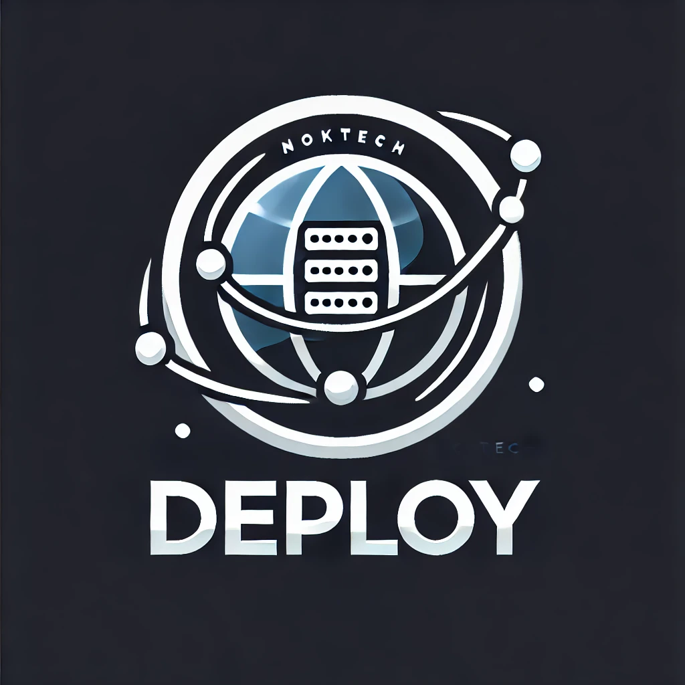

<div align="right">
    <a href="README.md">🇧🇷 Português</a> &nbsp;&nbsp;|&nbsp;&nbsp;
    <a href="README_en.md">🇺🇸 English</a>
</div>

# NokTech Deploy

<p align="center">
  
</p>

Um cliente de deploy avançado e flexível com suporte a múltiplos protocolos e observação de mudanças em tempo real.
Tenho certeza que você já passou por situações onde precisou fazer deploy de arquivos para um servidor, em diferentes cenários e IDEs,
e acabou se deparando com problemas como: ter que utilizar diferentes programas ou scripts para cada situação, ou ter que configurar
manualmente cada host, ou ainda, perder tempo configurando o ignore de arquivos. O NokTech Deploy veio para resolver esses problemas!
Com ele, você pode fazer deploy de arquivos para um servidor de forma fácil e rápida, com suporte a múltiplos protocolos e observação de mudanças em tempo real.
E o melhor de tudo, ele é open source!

## 📋 Características

- **Múltiplos Protocolos**
  - SSH/SFTP (senha ou chave SSH)
  - FTP
  - Local (cópia de arquivos local/rede)
- **Observação em Tempo Real**
- **Sistema de Ignore Avançado**
- **Interface Interativa**
- **Suporte Multi-idioma**
- **Logging Completo**

## 🚀 Instalação

### Via pip
```bash
pip install noktech-deploy
```

### Desenvolvimento
```bash
git clone https://github.com/Br3n0k/noktech-deploy.git
cd noktech-deploy
poetry install
```

## 💻 Uso

### Modo Interativo
Execute sem argumentos para interface guiada:
```bash
noktech-deploy
```

### SSH com Senha
```bash
noktech-deploy --protocol ssh \
               --host exemplo.com \
               --user deploy \
               --password "sua_senha" \
               --dest-path /var/www/app \
               --files-path ./dist
```

### SSH com Chave
```bash
noktech-deploy --protocol ssh \
               --host exemplo.com \
               --user deploy \
               --key-path ~/.ssh/id_rsa \
               --dest-path /var/www/app \
               --files-path ./dist
```

### FTP
```bash
noktech-deploy --protocol ftp \
               --host ftp.exemplo.com \
               --user ftpuser \
               --password senha123 \
               --dest-path /public_html \
               --files-path ./site
```

### Local
```bash
noktech-deploy --protocol local \
               --dest-path /mnt/backup \
               --files-path ./dados
```

### Modo Observador
```bash
noktech-deploy --protocol ssh \
               --host exemplo.com \
               --watch \
               # ... outras opções ...
```

## 📝 Configuração

### Arquivos Ignorados

#### .deployignore (Recomendado)
```plaintext
# Arquivos de desenvolvimento
__pycache__/
*.pyc
venv/

# Build e temporários
dist/
build/
*.tmp
*.log
```

#### Via Linha de Comando
```bash
noktech-deploy --ignore-patterns "*.temp" "logs/*" \
               # ... outras opções ...
```

[Documentação completa de ignore](docs/ignore_rules.md)

### Configurações Persistentes

O NokTech Deploy armazena configurações em `~/.noktech-deploy/config.json`:

```json
{
    "default_protocol": "ssh",
    "hosts": {
        "production": {
            "protocol": "ssh",
            "host": "exemplo.com",
            "user": "deploy"
        }
    }
}
```

## 📚 Documentação

- [API de Referência](docs/api.md)
- [Protocolos Suportados](docs/protocols.md)
- [Modo Observador](docs/watching.md)
- [Desenvolvimento](docs/development.md)
- [Exemplos](docs/examples.md)

## 🤝 Contribuindo

1. Fork o projeto
2. Crie sua branch (`git checkout -b feature/NovaFuncionalidade`)
3. Commit suas mudanças (`git commit -m 'Add: nova funcionalidade'`)
4. Push para a branch (`git push origin feature/NovaFuncionalidade`)
5. Abra um Pull Request

## 📄 Licença

Distribuído sob a licença MIT. Veja `LICENSE` para mais informações.

## 👤 Autor

**Brendown Ferreira**
- GitHub: [@Br3n0k](https://github.com/Br3n0k)
- Email: br3n0k@gmail.com

## 🔗 Links Úteis

- [Changelog](CHANGELOG.md)
- [Reportar Bug](https://github.com/Br3n0k/noktech-deploy/issues)
- [Solicitar Funcionalidade](https://github.com/Br3n0k/noktech-deploy/issues) 